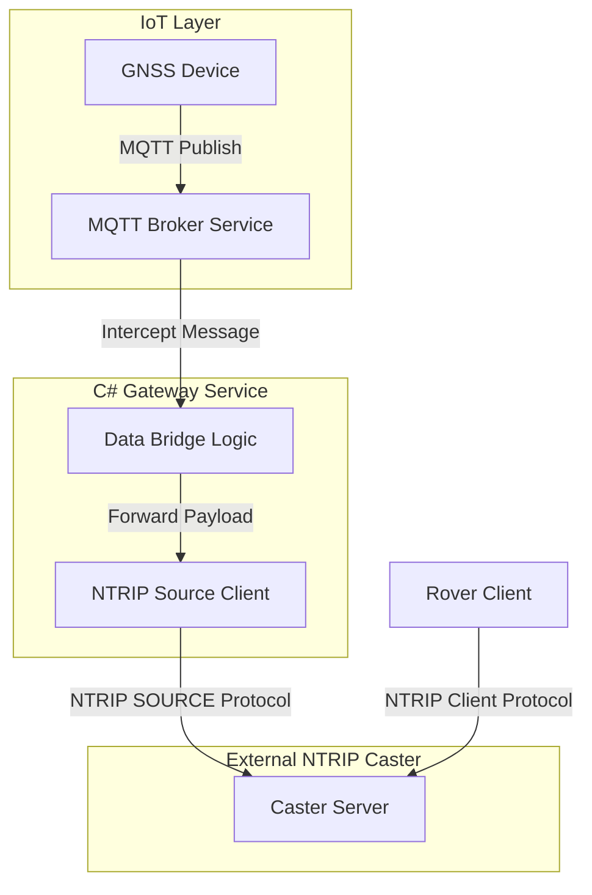

# Project Design Document

## 1. System Architecture

The system is designed as a protocol gateway that bridges MQTT (IoT) and NTRIP (GNSS) protocols.

## 2. Component Design

### MQTT Broker Service
- **Role**: Acts as a standard MQTT broker listening on port 1883.
- **Library**: `MQTTnet`
- **Authentication**: Validates Username/Password against `appsettings.json`.
- **Topic Interception**: Listens for messages on `ntrip/data` (configurable) to forward.

### NTRIP Source Service
- **Role**: Acts as an NTRIP Source connecting to a remote Caster.
- **Protocol**: TCP persistent connection with `SOURCE <password> <mountpoint>` handshake.
- **Reliability**: Implements auto-reconnection logic with exponential backoff.
- **Concurrency**: Thread-safe queue/buffer for sending data received from MQTT.

## 3. Data Flow
1. **Source Generation**: A GNSS Base Station or Simulator sends RTCM data via MQTT to topic `ntrip/data`.
2. **Ingestion**: `MQTTService` intercepts the publish packet.
3. **Bridging**: The payload (binary RTCM) is passed to `NtripService`.
4. **Transmission**: `NtripService` writes the data to the active TCP stream connected to the NTRIP Caster.
5. **Distribution**: The NTRIP Caster broadcasts the stream to connected Rovers (NTRIP Clients).

## 4. Configuration
Key settings in `appsettings.json`:
- `Mqtt:Port`: Broker listening port.
- `Mqtt:Auth`: Credentials for MQTT clients.
- `Ntrip:TargetCasterHost`: Remote Caster IP/Domain.
- `Ntrip:Mountpoint`: The mountpoint to push data to.
- `Ntrip:Password`: Source password for the Caster.
